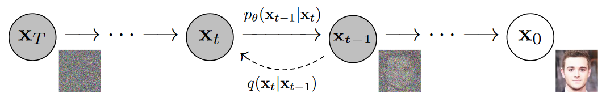
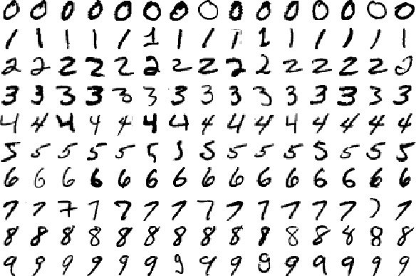

<link rel="stylesheet" href="../../css/counter.css" />

# Denoising Diffusion Probabilistic Model

!!! warning "To be continued..."

## 扩散模型与 DDPM

扩散模型以其训练稳定性、生成数据的多样性和高质量受到广泛关注，迅速成为目前的生成式模型前沿。DDPM (Denoising Diffusion Probabilistic Model) 是最基本的扩散模型，如下图所示：

设原始的真实图像为 $x_0$，分 $T$ 步对其依次加单位高斯噪声 ($\mathcal{N}(0, I)$)，可以近似认为得到的是一个纯高斯噪声。如果能够预测出每步添加的噪声，那么将可以从一个纯高斯噪声逐步去噪生成一张新的真实图像。

## Dataset: MNIST

MNIST 数据集 (Mixed National Institute of Standards and Technology database) 是美国国家标准与技术研究院收集整理的大型手写数字数据库，包含 60,000 个示例的训练集以及 10,000 个示例的测试集。

一般给出的 MNIST 数据集下载链接为 http://yann.lecun.com/exdb/mnist/index.html，然而目前需要登录验证，因此使用 `torchvision.datasets` 的方法准备该数据集。

不同于常见的深度学习入门使用 LeNet-5 在 MNIST 上进行分类，本实验将基于 DDPM 建模 MNIST 手写数字的数据分布，从而能够采样**生成新的手写数字图片**。
