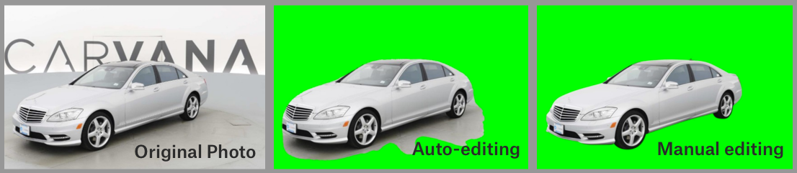

<link rel="stylesheet" href="../../css/counter.css" />

# U-Net

!!! info "Lab4 for ZJU 2023 *Computer Vision* course, [link](https://zhoutimemachine.github.io/2023_CV/hw4/)"

[U-Net](https://en.wikipedia.org/wiki/U-Net) 是一个经典的语义分割全卷积网络，最初应用于医疗图像的分割任务。其网络结构如下图所示，可以看到 U-Net 有一个对称的结构，左边是一个典型的卷积神经网络，右边是一个对称的上采样网络，可以将左边的特征图恢复到原图大小。

<div style="text-align:center;">

</div>

更多详细内容可以参考 U-Net 原论文 [U-Net: Convolutional Networks for Biomedical Image Segmentation](https://arxiv.org/abs/1505.04597)。

## Dataset: Carvana

[Carvana dataset](https://www.kaggle.com/competitions/carvana-image-masking-challenge/data) 是 [kaggle](https://www.kaggle.com/) 上的一个语义分割竞赛数据集，目标是实现对汽车的分割。

<div style="text-align:center;">

</div>

根据 Carvana 数据集的划分，其训练集包含 5088 张汽车图片 (.jpg) 和对应的掩码 (mask, .gif)，掩码可以认为是 0-1 的，表示图片上每个像素是否属于汽车。因此这个问题可以处理成逐像素的二分类问题。

不要求下载该数据集进行训练，将提供已在训练集上训练好的模型。

## U-Net Completion and Inference

### Structure of U-Net

<div style="text-align:center;">

</div>

在 U-Net 原论文 [U-Net: Convolutional Networks for Biomedical Image Segmentation](https://arxiv.org/abs/1505.04597) 中：

- 左侧向下的结构被称为 Contracting Path，由通道数不断增加的卷积层和池化层组成
- 右侧向上的结构被称为 Expanding Path，由通道数不断减少的卷积层和上采样层（反卷积层）组成
- 在 Expanding Path 中，每次上采样层都会将 Contracting Path 中对应的特征图与自身的特征图进行拼接，这样可以保证 Expanding Path 中的每一层都能够利用 Contracting Path 中的信息

### Network Completion

要求完成 [unet.py](code/unet.py) 中全部的 `TODO`，使得所提供的训练好的模型可以被正确加载。

整体上来看，需要完成的内容为 `UNet` 类 `__init__` 中部分卷积层的定义，以及 `forward` 函数中的 Contracting Path 和 Expanding Path 的前递。不过，`UNet` 类 `__init__` 补全过程中还需要实现 `CropAndConcat` 类。

!!! warning "以下代码只是展示一个框架便于纵观全部内容，请点击文档中 [unet.py](code/unet.py) 文字所对应的链接下载包含更多提示的模板进行网络补全"

```python
class UNet(nn.Module):
    def __init__(self, in_channels: int, out_channels: int):
        ...

        # TODO: Double convolution layers for the contracting path.
        ...

        # Down sampling layers for the contracting path

        # TODO: The two convolution layers at the lowest resolution (the bottom of the U).

        # Up sampling layers for the expansive path.

        # TODO: Double convolution layers for the expansive path.
        ...

        # Crop and concatenate layers for the expansive path.
        # TODO: Implement class CropAndConcat starting from line 6
        ...
        
        # TODO: Final 1*1 convolution layer to produce the output
        ...


    def forward(self, x: torch.Tensor):
        """
        :param x: input image
        """
        # TODO: Contracting path
        ...

        # Two 3*3 convolutional layers at the bottom of the U-Net
        x = self.middle_conv(x)

        # TODO: Expansive path
        ...

```

#### `__init__`: Convolution Layers

- 通道数的变化已经在前面的图中进行了标注。和原论文不同，训练时 final_conv 的输出通道改成了 1，但是在通用的网络结构中就是 `out_channels`
- down_conv, mid_conv 和 up_conv 都是由两个卷积层组成，每个卷积层都是 $3\times 3$ 的卷积核，padding 为 $1$，stride 为 $1$。每个卷积层后都有一个 ReLU 激活函数，整体顺序为 Conv2d-Relu-Conv2d-Relu
- final_conv 是一个 $1\times 1$ 的卷积层，padding 为 $0$，stride 为 $1$，没有激活函数

!!! tip "只需要在有 `TODO` 的地方填写，在 `nn.Sequential` 的括号中正常填写 `nn.Conv2d`, `nn.ReLU` 即可。不要自定义网络类，避免模型因为层命名不一致而加载失败。"

#### `CropAndConcat` Class 

`CropAndConcat` 类的作用是将 Contracting Path 中的特征图与 Expanding Path 中的特征图进行拼接，以保证 Expanding Path 中的每一层都能够利用 Contracting Path 中的信息。

- 需要使用 `torchvision.transforms.functional.center_crop(...)` 对 Contracting Path 中的特征图进行裁剪，以保证尺寸一致能够成功拼接
- `b, c, h, w` 四个变量并不是都会用到，但是你需要知道它们的含义，便于正确使用 `center_crop(...)`
    - `b`：batch size
    - `c`：channel
    - `h`：height
    - `w`：width
- 请自行搜索查找 `torch.cat()` 的用法，使得能符合原论文中的拼接方式
- 与图中相反，实际拼接的顺序为 Expanding Path 中的 feature map 在左，Contracting Path 中的feature map 在右
- 这里的代码量非常小，基本两三行，不要写复杂了


```python
class CropAndConcat(nn.Module):
    """
    ### Crop and Concatenate the feature map

    Crop the feature map from the contracting path to the size of the current feature map
    """
    def forward(self, x: torch.Tensor, contracting_x: torch.Tensor):
        """
        :param x: current feature map in the expansive path
        :param contracting_x: corresponding feature map from the contracting path
        """

        b, c, h, w = x.shape

        # TODO: Concatenate the feature maps
        # use torchvision.transforms.functional.center_crop(...)
        x = torch.cat(
            # ...
        )
        
        return x
```

#### `forward` in `UNet` Class

前面如果都实现正确，这里是比较简单的，相当于对着图连线。注意在 Contracting Path 中保留中间结果，在 Expanding Path 中 Crop and Concat 时可以使用。

#### Test the Network Completion

提供模型文件 `model.pth`，你可以用以下的代码测试你补全的网络是否能成功加载该模型。

```python
import argparse
import torch
from unet import UNet

if __name__ == "__main__":
    parser = argparse.ArgumentParser(description='Predict masks from input images')
    parser.add_argument('--model', '-m', default='model.pth',
                        help='Specify the file in which the model is stored')
    args = parser.parse_args()
    device = torch.device('cuda' if torch.cuda.is_available() else 'cpu')

    print(f'Loading model {args.model}')
    print(f'Using device {device}')

    model = UNet(in_channels=3, out_channels=1).to(device)
    state_dict = torch.load(args.model, map_location=device)
    model.load_state_dict(state_dict)

    print('Model loaded')
```

例如，将该测试代码写在 `try.py`，并将其和 `unet.py` 放在同一目录下，用 `--model` 指定 `model.pth` 的路径，以模型文件和代码在同一目录为例，则可以运行

```bash
python try.py --model model.pth
```

如果输出
```
Loading model model.pth
Using device cpu
Model loaded
```

则说明你的网络补全正确。当然，第一二行的输出不同情况可能不同，我们关注的重心在于第三行输出 "Model loaded"。

#### Inference for Single Image

要求加载提供的模型 `model.pth`，对提供的[单张汽车图片](graph/infer.jpg)的 mask 进行推断，有如下的关键点：

- 使用 `Image.open()` 读入的单张图片需要利用 `torchvision.transforms` 进行适当的预处理。
    - Resize 为 572
    - 转换为 Tensor
- 可能需要用到 `torch.nn.functional.interpolate` 进行插值，和图片尺寸匹配
- 模型的输入输出都具有 `[B, C, H, W]` 的格式
- 模型直接产生的输出是一个 score。首先需要用 sigmoid 进行处理，然后使用一定的阈值来将其转换为 0-1 的 mask

在这里简单提供给定图片 `img`、预测的掩码 `mask` 和保存图片名 `filename` 而将图片和预测的掩码以 `filename` 保存的代码：

```python
import matplotlib.pyplot as plt

def plot_img_and_mask(img, mask, filename):
    classes = mask.max()
    fig, ax = plt.subplots(1, classes + 1)
    ax[0].set_title('Input image')
    ax[0].imshow(img)
    ax[1].set_title('Mask')
    ax[1].imshow(mask == 0)
    plt.savefig(filename)
    plt.close()
```

效果如下图所示：

<div style="text-align:center;">

</div>

## Download Links

- [unet.py](code/unet.py)
- [try.py](code/try.py)
- model.pth: 暂缺，如有需要可以联系 [ZhouTimeMachine](https://github.com/ZhouTimeMachine)

## References

- [PyTorch](https://pytorch.org/)
- [PyTorch Lightning](https://www.pytorchlightning.ai/)
- [MNIST dataset](http://yann.lecun.com/exdb/mnist/index.html) (verification is needed)
- LeNet paper [Gradient-based learning applied to document recognition](https://ieeexplore.ieee.org/abstract/document/726791)
- [PyTorch extending](https://pytorch.org/docs/stable/notes/extending.html)
- [Dive into Deep Learning](https://d2l.ai/)
- [Carvana dataset](https://www.kaggle.com/competitions/carvana-image-masking-challenge/data)
- U-Net paper [U-Net: Convolutional Networks for Biomedical Image Segmentation](https://arxiv.org/abs/1505.04597)